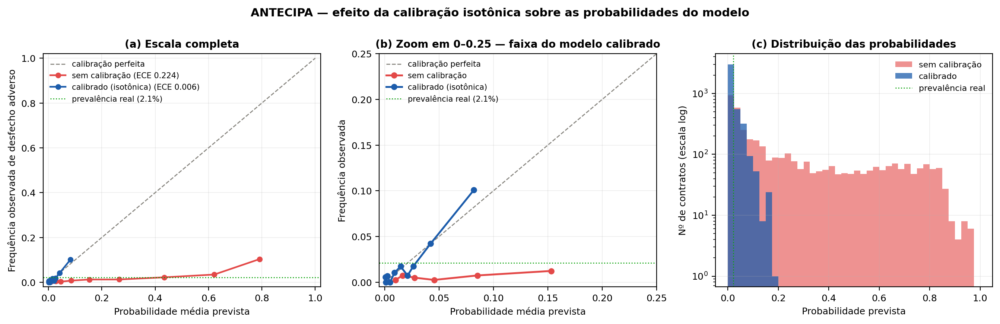
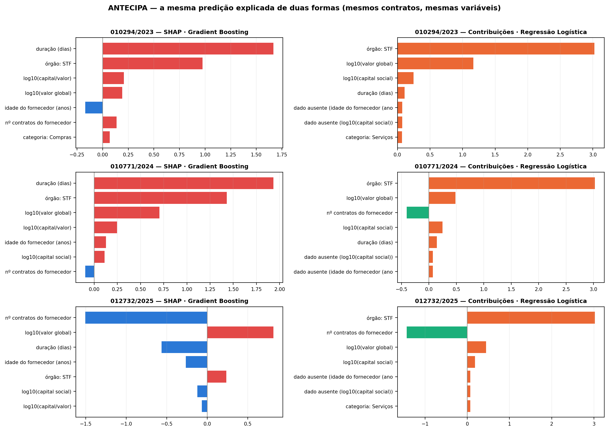

# ANTECIPA — Resultados técnicos e metodologia

Documento consolidado dos experimentos deste repositório: rotulagem, protocolo de
avaliação, resultados dos modelos e achados de engenharia de dados. Os relatórios
detalhados de cada experimento estão em `dados/processados/`. Visão geral do
pipeline e instruções de execução: [README.md](README.md).

Todos os dados são públicos (PNCP, compras.gov.br, dados abertos do CNPJ). Este é
um protótipo acadêmico; os escores não constituem juízo sobre nenhuma empresa.

---

## 1. Escopo e dados

| Fonte | Conteúdo | Volume |
|---|---|---|
| API de Consulta do PNCP | Contratos de 11 órgãos do Judiciário federal desde 2023 | 31.907 registros → **25.488 contratos únicos** |
| API do PNCP — termos | Aditivos, apostilamentos e rescisões, com data e valores | base do rótulo |
| API de busca do PNCP | Presença nacional dos maiores fornecedores do STF | top-15 da carteira |
| Dados abertos do CNPJ (Receita Federal) | Capital social, porte, idade, CNAE, situação cadastral | 9.598 de 9.600 fornecedores |
| Pesquisa de preços do compras.gov.br | Distribuição nacional de preços homologados por item | 7 itens |

Recorte temporal: vigência plena da Lei 14.133/2021 (2023 em diante). Na carteira
do STF: 365 registros de contrato (R$ 1,195 bilhão), 237 termos aditivos, 22
rescisões/extinções.

## 2. Rotulagem pelo desfecho real

O rótulo **não** deriva da matriz de risco — deriva do que aconteceu depois da
assinatura, extraído dos termos publicados no PNCP: rescisão/extinção, acréscimo
de valor > 25 % ou prorrogação > 365 dias. Isso evita a circularidade de treinar
um modelo nos rótulos gerados pelas próprias regras que ele deveria superar.

Na **v2**, o rótulo ganhou **horizonte fixo de 12 meses** (evento datado pelo
termo) e só entram contratos com 12 meses completos de observação. A correção
eliminou um artefato de censura à direita: na v1 a prevalência "caía" de 5,2 %
no treino para 1,6 % no teste apenas porque contratos recentes ainda não tinham
tido tempo de acumular termos. Com horizonte fixo, a prevalência fica estável por
coorte de assinatura: **1,5 % (2023) · 1,7 % (2024) · 2,1 % (2025)**.

## 3. As três leituras de risco

Cada contrato é apresentado sob três leituras, que respondem a perguntas
diferentes. Duas são *ex-ante*; uma é retrospectiva.

**(a) Nível ex-ante — Res. 781/2022.** Escore heurístico que parte de 1,0 ponto e
soma apenas fatores conhecidos na assinatura: capital social < 2 % do volume
contratado nacional `+1,2` (> 30 % `−0,5`; não informado `+0,3`); CNPJ < 3 anos
`+0,8` (> 10 anos `−0,4`); crescimento contratual atípico ≥ 3× a mediana no PNCP
`+1,0`; situação cadastral ≠ "Ativa" `+1,5`; vigência > 12 meses `+0,4`. Total
arredondado e limitado a 1–5.

**(b) Probabilidade prevista — modelo supervisionado.** Gradient Boosting com
calibração isotônica (5 folds). Treino: 16.783 contratos de 11 órgãos
(2022–2025). Variáveis: apenas as disponíveis na assinatura. Na matriz, a
probabilidade vira escala 1–5 por faixas fixas (1: < 2 % · 2: 2–5 % · 3: 5–10 % ·
4: 10–20 % · 5: ≥ 20 %), ancoradas na taxa base e não em quantis.

**(c) Nível observado — Res. 781/2022.** O mesmo escore de (a) acrescido do que já
ocorreu: ≥ 2 aditivos `+0,8`; valor acumulado > 10 % acima do inicial `+0,8`;
rescisão/extinção registrada `+1,5`. Leitura retrospectiva — parte do que ela mede
já é o problema materializado.

Em (a) e (c), o eixo de **impacto** (1–5) é o quintil do valor global na carteira,
e o **nível** vem do produto probabilidade × impacto: ≤ 4 Baixo · ≤ 9 Moderado ·
≤ 16 Elevado · > 16 Crítico.

> **Ressalva:** o escore ex-ante é uma reconstrução feita no presente — usa os
> dados cadastrais atuais da Receita, que podem ter mudado desde a assinatura. A
> versão rigorosa exigiria séries históricas, indisponíveis na base aberta.

## 4. Protocolo de avaliação

Validação **temporal** (treino ≤ 2024, teste 2025), métricas próprias de classe
rara — precision, recall e F1 da classe positiva, PR-AUC e ROC-AUC; **nunca
acurácia**. O limiar de decisão é escolhido no treino (máximo F1 em validação
cruzada), jamais no teste. O baseline heurístico é avaliado nas mesmas condições.

## 5. Resultados

### 5.1 Modelo principal — teste temporal 2025

| Modelo | Precision | Recall | F1 | PR-AUC | ROC-AUC |
|---|---|---|---|---|---|
| **Gradient Boosting v2 (12 meses)** | 0,109 | 0,494 | 0,179 | **0,139** (lift 6,6×) | 0,806 |
| Regressão Logística v2 | 0,052 | 0,647 | 0,096 | 0,065 | 0,755 |
| Gradient Boosting v1 | 0,064 | 0,393 | 0,111 | 0,071 (lift 4,4×) | 0,798 |
| Baseline heurístico (Res. 781) | 0,067 | 0,129 | 0,088 | 0,033 (lift 2×) | 0,705 |

Visão operacional: entre os 100 contratos de 2025 com maior escore v2, **16
tiveram desfecho adverso real** em 12 meses — 7,6× a taxa base — capturando 19 %
de todos os adversos do ano.

Detalhes: [`relatorio_modelo.md`](dados/processados/relatorio_modelo.md) (v1),
[`relatorio_modelo_v2.md`](dados/processados/relatorio_modelo_v2.md) (v2).

### 5.2 Treinar só com STF × multi-órgão

Mesmo teste (contratos do STF assinados em 2025: 106 contratos, 13 adversos). O
modelo só-STF (148 contratos de treino) obteve PR-AUC 0,384; o multi-órgão
(12.483 contratos), 0,319. **Bootstrap com 4.000 reamostras: Δ = +0,069, IC 95 %
[−0,221; +0,350]** — diferença não conclusiva.

Leitura equilibrada: o padrão local do STF carrega sinal específico relevante (sua
carteira tem prevalência de desfecho adverso muito superior à dos demais órgãos),
mas o multi-órgão entrega desempenho comparável com 84× mais dados e muito mais
estabilidade. Caminho sugerido: treinar no padrão nacional e calibrar por órgão.

Detalhes: [`comparacao_stf_vs_multi.md`](dados/processados/comparacao_stf_vs_multi.md).

### 5.3 Calibração das probabilidades

O treino com `class_weight='balanced'` distorce a escala de saída: o número
produzido é escore inflado, não probabilidade. A calibração isotônica aprende, dos
próprios dados, o mapeamento entre escore e frequência observada.

| Métrica (teste temporal 2025) | Sem calibração | Calibrado | Referência |
|---|---|---|---|
| Probabilidade média prevista | 24,5 % | **2,0 %** | 2,1 % (frequência real) |
| ECE — erro de calibração esperado | 0,2240 | **0,0063** | 0 (ideal) |
| Brier score | 0,1280 | **0,0196** | menor é melhor |
| ROC-AUC (discriminação) | 0,8064 | 0,8019 | — |

O modelo bruto prevê em média 24,5 % onde a frequência real é 2,1 % —
superestimativa de ~12×. Após a calibração, a média coincide com a realidade e o
ECE cai 36×. **O ROC-AUC permanece essencialmente inalterado**: como a
transformação é monotônica, a ordenação é preservada — a calibração torna a escala
interpretável sem alterar a capacidade de discriminar.

Reproduzir: `python pipeline/diagrama_calibracao.py`.

### 5.4 A matriz ex-ante não discrimina na carteira do STF

Aplicando os critérios de alerta aos 365 contratos do STF (taxa base de desfecho
adverso: **22,7 %**):

| Critério de alerta | Alertas | Acertos | Precisão | Recall | Lift |
|---|---|---|---|---|---|
| **Ex-ante (Res. 781, Elevado/Crítico)** | 52 | 12 | **23,1 %** | 14,5 % | **1,01×** |
| ML ≥ 20 % | 100 | 57 | 57,0 % | 68,7 % | 2,51× |
| ML ≥ 10 % | 159 | 65 | 40,9 % | 78,3 % | 1,80× |
| ML ≥ 5 % | 232 | 74 | 31,9 % | 89,2 % | 1,40× |
| **ML top-52** (mesmo volume do ex-ante) | 52 | 30 | **57,7 %** | 36,1 % | 2,54× |
| *(referência)* Observado, Elevado/Crítico | 66 | 22 | 33,3 % | 26,5 % | 1,47× |

A heurística ex-ante tem precisão de 23,1 % contra taxa base de 22,7 % — **lift
1,01×, ou seja, não discrimina**. Sortear 52 contratos ao acaso acertaria
praticamente o mesmo (esperado ~11,8; obtido 12). No mesmo custo operacional, o
modelo identifica **30 contratos problemáticos contra 12**.

Três ressalvas: (i) os números do ML aqui são **otimistas** — contratos do STF
integraram o treino; a medição fora da amostra é a da seção 5.1; (ii) o rótulo
aqui é o mais frouxo ("adverso a qualquer momento"), então **lift** é a coluna
comparável entre contextos, não a precisão absoluta; (iii) a heurística falha
justamente no STF porque a carteira é homogeneamente de alto risco pelos critérios
da norma — quase tudo é serviço continuado, longo e de valor elevado, saturando as
variáveis discriminantes. Numa base multi-órgão heterogênea ela ainda apresentava
sinal (lift ~4×).

### 5.5 Escolha da técnica de explicação: SHAP × modelo substituto

A primeira versão explicava cada contrato pelas contribuições de uma regressão
logística treinada nos mesmos dados — um **modelo substituto**, que explica a si
mesmo e não o Gradient Boosting do qual vem a probabilidade. A decisão de trocar
foi tomada por medição, não por preferência teórica:

| Indicador de concordância entre as duas explicações | Valor |
|---|---|
| Correlação de Spearman média entre as atribuições | 0,222 |
| Contratos em que o **fator principal coincide** | **12,3 %** |
| Sobreposição média entre os três principais fatores | 56,3 % |
| Contratos analisados | 293 |

Em ~9 de cada 10 contratos, o fator exibido como principal não era o principal do
modelo real. A causa é estrutural: em variáveis *one-hot*, a contribuição da
logística é o coeficiente × 1 — **constante para todo contrato do mesmo órgão**.
"órgão: STF" aparecia como fator nº 1 em praticamente todos os casos, com
magnitude fixa, dominando a explicação sem discriminar nada. A importância global
confirma a inversão: a variável de maior peso no GB (**duração**, 1,521) tinha
peso quase 10× menor na logística (0,156), enquanto "órgão: STF" liderava nesta
última (3,024) contra 0,810 no modelo real.

As explicações foram migradas para **SHAP (TreeExplainer) sobre o próprio Gradient
Boosting**. Duas providências acompanharam a migração: as contribuições dos níveis
de cada variável categórica passaram a ser **somadas por variável original** (sem
isso, o SHAP atribui valor a níveis que o contrato não assume — p. ex. "órgão:
TSE" em contrato do STF, medindo a contribuição de *não* ser do TSE); e mede-se a
fidelidade ao modelo publicado.

> **Ressalva de fidelidade:** o SHAP explica o GB ajustado sobre toda a base,
> enquanto a probabilidade vem do mesmo algoritmo calibrado em 5 partições.
> Concordância de ordenação: **Spearman 0,878** — muito acima dos 0,222 do
> substituto, porém inferior a 1. Parte da diferença é artefato de empates: a
> calibração isotônica reduz os 293 contratos do STF a 111 valores distintos,
> penalizando o coeficiente. O valor fica gravado em `ml_stf_v2.json` como
> `fidelidade_shap_spearman`.

Permanece defensável a alternativa oposta — publicar a própria regressão logística
como modelo, abrindo mão de ~metade do poder preditivo (PR-AUC 0,065 contra 0,139)
em troca de um sistema em que a explicação **é** o modelo. O que não se sustenta é
a combinação anterior: modelo de árvores explicado por modelo linear distinto.

Detalhes: [`comparacao_explicacoes.md`](dados/processados/comparacao_explicacoes.md).
Reproduzir: `python pipeline/compara_explicacoes.py`.

## 6. Achados de engenharia de dados

1. **O STF não preenche `catalogoCodigoItem`** (CATMAT/CATSER) nos itens que
   publica no PNCP — 0 de 916 itens tinham o campo. A comparação nacional de
   preços exigiu reconstruir a ponte descrição → PDM → códigos via catálogo do
   compras.gov.br.
2. **As listas paginadas do PNCP contêm duplicatas** (republicações/retificações):
   o TST retorna 13.765 registros para 9.407 contratos únicos. Deduplicação por
   `numeroControlePncp` é obrigatória em qualquer uso analítico.
3. **CNPJs raiz agregam unidades**: TST e TSE trazem as unidades regionais da
   Justiça do Trabalho e Eleitoral — útil para volume, exige atenção ao
   interpretar "órgão".
4. **Serviços continuados são publicados como item único de valor global**
   (quantidade 1), inviabilizando comparação unitária de preços de serviços sem
   normalização adicional.
5. **Consórcios aparecem com capital social zero** na base aberta da Receita — é
   dado não informado, não "empresa sem lastro"; o escore trata o caso à parte.
6. **A API do PNCP aplica rate-limit** (HTTP 429) em coletas longas; o pipeline usa
   retry com backoff e um passe de reparo (`repara_multi.py`).

## 7. Limitações

- O rótulo captura desfechos administráveis (aditivos, prorrogações, rescisões) —
  não fraude ou conluio, raros e não observáveis nestas bases. O PNCP também não
  distingue o **motivo** da rescisão (inadimplemento × conveniência da
  Administração), o que torna o rótulo um proxy grosseiro.
- O horizonte de 12 meses não captura desfechos tardios (p. ex. aditivos do 2º ano
  de serviços continuados); sensibilidade com 18/24 meses fica como extensão.
- `nº contratos do fornecedor` é contado no dataset completo — leve vazamento
  temporal; em produção, contar apenas contratos anteriores à assinatura.
- A precisão absoluta dos alertas é baixa (classe rara): o uso correto é
  ranqueamento com fila por capacidade de diligência, com decisão sempre humana.
- Comparações de preço por PDM agregam especificações heterogêneas: desvios
  disparam diligência, nunca conclusão de sobrepreço.
- Sanções (CEIS/CNEP, SICAF, CNDT) não integram o modelo — dependem de
  credenciamento institucional.
- Pequenas lacunas de coleta permanecem onde o rate-limit persistiu (TRF5/2026 e
  páginas profundas de TST/TSE 2023).

## 8. Nota sobre a operacionalização da Res. 781/2022

A Resolução fornece a moldura (escalas 1–5 de probabilidade e impacto,
classificação pelo produto), mas **não fornece uma tabela que converta dados
observáveis em pontos**. A tabela de pesos usada no baseline (seção 3a) é uma
operacionalização proposta neste trabalho — plausível, porém arbitrária, e não
verificada contra o texto integral da norma. Recomenda-se validá-la com os
gestores de risco do órgão antes de qualquer uso institucional.

Importante: o resultado central (modelo supervisionado) **não depende dessa
tabela** — o rótulo vem do desfecho real, justamente para escapar da
circularidade.
